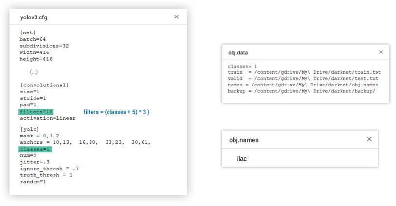

##### Purpose of Project

Detection of Pills from images and video.

[Click here for labeled dataset](https://drive.google.com/open?id=1D6W5ZTk6ZlGPZRj8uF3w2o_6tz3WmK6u) 

##### Labeling Images 
[Open Labeling Tool](https://github.com/Cartucho/OpenLabeling) is used.

##### Splitting Dataset 
Here is the python [script](https://github.com/yavuzKomecoglu/darknet/blob/master/scripts/process.py) that splits 90% training and 10% test data. You will have train.txt and test.txt files. Each file has image paths.

##### Creating and Editing necessary Files
* obj.data (information about number of classes and file paths)
* obj.names (class names)
* yolov3.cfg (editing number of classes and filters)

Since we have 1 class (Pill (turkish meaning: ilac)) our filter must be 18 according to formula.
$$
Filters = (number\ of\ classes + 5) * 3
$$

##### Creating Google Drive Folder

You need to create a folder shown in that [image](http://blog.ibanyez.info/download/B20190410T000000072.png) 

[Click here for my Google Drive folder](https://drive.google.com/open?id=1sCZ6y5W_iXmiyh6Ejzfe0p_BIrpM_goP)

## References

* [How to train YOLOv3 using Darknet on Colab 12GB-RAM GPU notebook and speed up load times](http://blog.ibanyez.info/blogs/coding/20190410-run-a-google-colab-notebook-to-train-yolov3-using-darknet-in/)
* [YOLOv2 ile Kendi Özel Kişi ya da Nesnemizin Algılanmasını Nasıl Sağlarız? — Bölüm 2](https://medium.com/yavuzkomecoglu/yolov2-ile-kendi-%C3%B6zel-ki%C5%9Fi-yada-nesnemizin-alg%C4%B1lanmas%C4%B1n%C4%B1-nas%C4%B1l-sa%C4%9Flar%C4%B1z-b%C3%B6l%C3%BCm-2-c717f5231e46)
* [Training YOLOv3 : Deep Learning based Custom Object Detector](https://www.learnopencv.com/training-yolov3-deep-learning-based-custom-object-detector/)
* [How to train YOLOv3 to detect custom objects](https://medium.com/@manivannan_data/how-to-train-yolov3-to-detect-custom-objects-ccbcafeb13d2)
* [Github Repo](https://github.com/kriyeng/yolo-on-colab-notebook)
